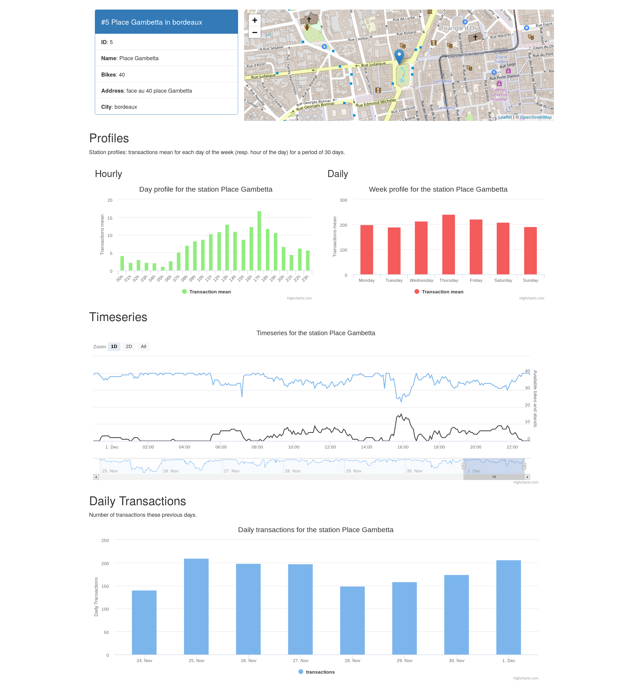

# Jitenshea: bicycle-sharing data analysis

 

It's an archived repo.

**MOVED TO** https://gitlab.com/Oslandia/jitenshea

In Japanese:

Jitensha (bicycle) + Shea (share) = Jitenshea

Analyze bikes sharing station data in some cities where there are Open Data.

You have three parts in this project:

* a data pipeline and data processing with [luigi](http://luigi.readthedocs.io/)
  to get, transform and store data

* Some statistics and Machine Learning to analyze the time series and predict the
  bikes availability for each station.

* Web application to get and visualize some data through a REST API

## Data

Open Data from the French cities Bordeaux and Lyon:

* [Data Grand Lyon Website](https://data.grandlyon.com/equipements/station-vflov-disponibilitfs-temps-rfel/)
* [Data Bordeaux Website](https://data.bordeaux-metropole.fr/data.php?themes=10)

Some luigi [tasks](./jitenshea/tasks) can be called every 10 minutes for instance
to gather the bicycle-sharing stations data. Another one is called every day to
aggregate some data. You can use [cron-job](https://cron-job.org/en/) to carry
out this stuff.

Contributions for other cities are welcomed! e.g. Nantes, Paris, Marseille, etc.

## Configuration

A configuration file sample can be found at the root directory
[config.ini.sample](./config.ini.sample). Copy it into the `jitenshea` directory, 
rename it into `config.ini` and update it.

It is used for the database access, some tokens for API, etc.

## Requirements

PostgreSQL database with PostGIS. You must have the `shp2pgsql` command.

All **Python** requirements are specified in the `setup.py` file.

Create a new `virtualenv`, then do `pip install .` in the project root directory.

For **Javascript** and **CSS** dependencies, you have to install `yarn` then launch
`yarn install`.

## Development

* Install the extras dependencies, e.g. `pip install -e ."[dev]"`.
* Launch test with  `pytest`.

## Logo

Logo was designed by [Sylvain](https://github.com/sylvainbeo). Thanks to him!
