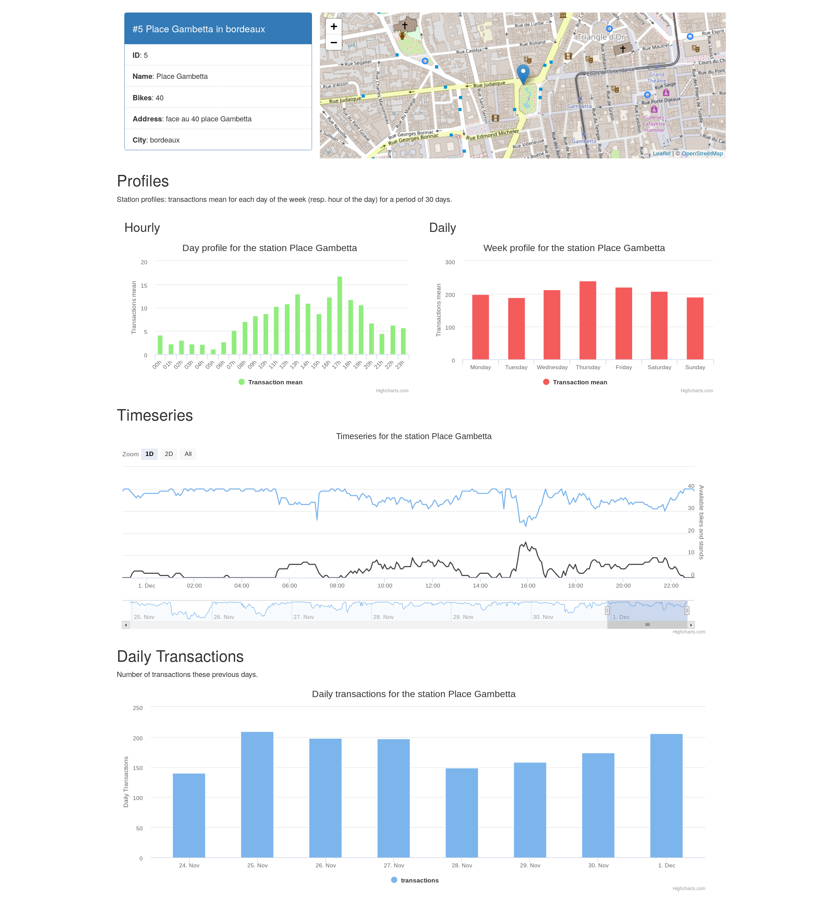

# Jitenshea: bicycle-sharing data analysis

 

Jitensha (bicycle) + Shea (share) = Jitenshea

Analyze bikes sharing station data some cities where there Open Data.

You have to parts in the project:

* a data pipeline and data processing with [luigi](http://luigi.readthedocs.io/)
  to get, transform and store data

* Web application to get and visualize some data through a REST API

## Data

Open Data from French cities Bordeaux and Lyon:

* [Data Grand Lyon Website](https://data.grandlyon.com/equipements/station-vflov-disponibilitfs-temps-rfel/)
* [Data Bordeaux Website](https://data.bordeaux-metropole.fr/data.php?themes=10)

Some luigi [tasks](./jitenshea/tasks) can be called every 10 minutes for instance
to gather the bicycle-sharing stations data. Another one is called every day to
aggregate some data. You can use [cron-job](https://cron-job.org/en/) to carry
out this stuff.

## Configuration

A configuration file sample can be found at the root directory
[config.ini.sample](./config.ini.sample). Copy it into the `jitenshea` directory
, rename it into `config.ini` and update it.

It is used for the database access, some tokens for API, etc.

For the wep application, you can launch `bower` to install Javascript and CSS dependencies.

## Requirements

PostgreSQL database with PostGIS. You must have the `shp2pgsql` command.

* Python 3.6
* pandas
* requests
* luigi
* sh
* psycopg2
* flask-restplus
* daiquiri

See the `conda_env.s` script to create a conda environment with the dependencies.

**Note**: flast-restplus and daiquiri should be install via `pip`.
